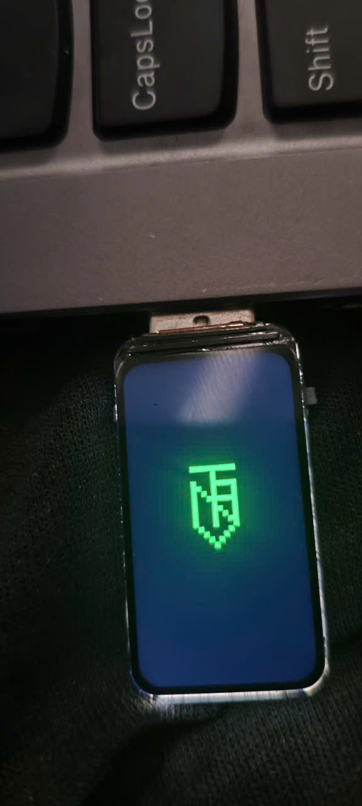
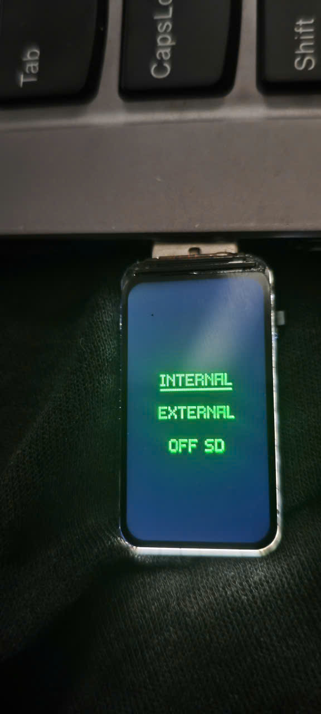
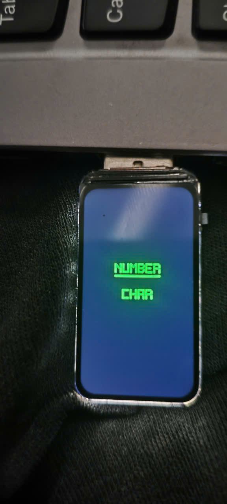
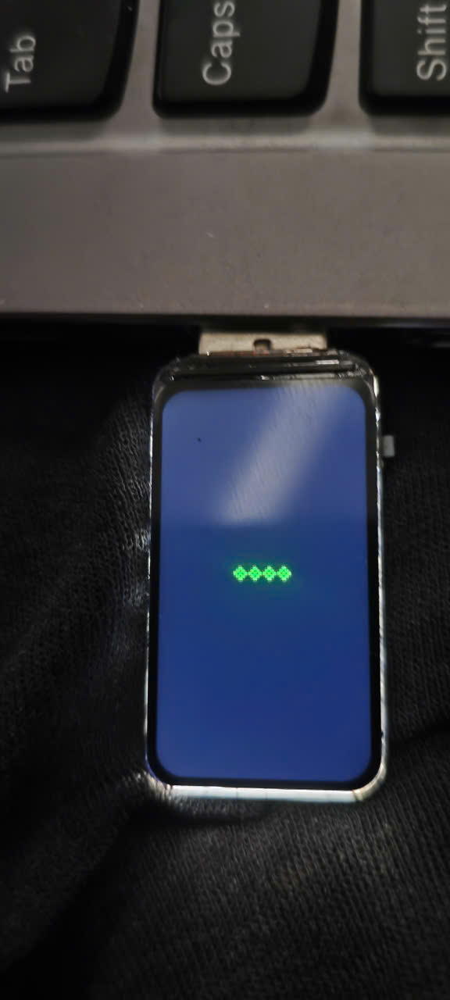
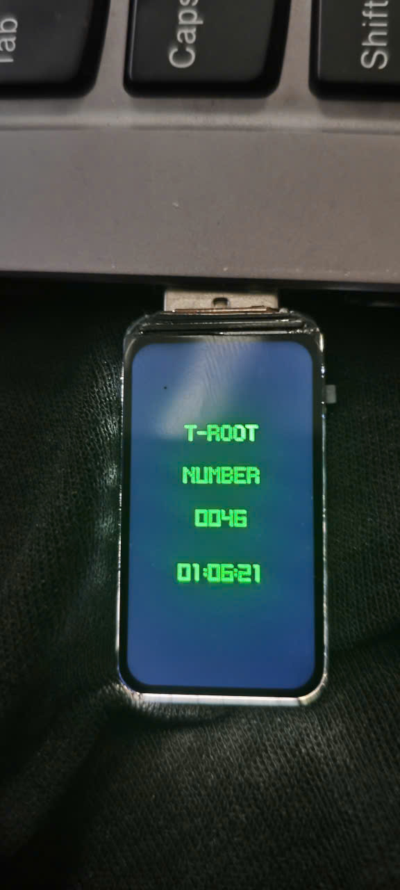

# T-ROOT Counter - Hướng Dẫn Sử Dụng

## 📋 Tổng Quan

Đây là một thiết bị counter tự động với nhiều tính năng tích hợp, được thiết kế để đếm số và tự động nhập vào máy tính qua USB HID Keyboard. Thiết bị có màn hình LCD, LED RGB, và hỗ trợ SD Card qua USB Mass Storage.

## 🎯 Mục Đích Sử Dụng

- **Tự động đếm số**: Đếm từ 0 đến giá trị tối đa với tốc độ có thể điều chỉnh
- **Tự động nhập số**: Gửi số đếm vào máy tính như bàn phím USB (HID Keyboard)
- **Hiển thị thông tin**: Màn hình LCD hiển thị số đếm, thời gian còn lại, và tốc độ
- **Lưu trữ dữ liệu**: SD Card có thể truy cập qua USB như ổ đĩa ngoài
- **Điều khiển LED**: LED RGB với nhiều màu sắc tự động chuyển đổi

## ✨ Tính Năng

### 1. **Counter Tự Động**
- Đếm số từ 0 đến giá trị tối đa (tùy chọn số chữ số: 1-10)
- Tự động tăng số theo khoảng thời gian đã cài đặt
- Hiển thị số trên màn hình LCD với font lớn, dễ đọc
- Hỗ trợ tạm dừng (pause) và tiếp tục

### 2. **USB HID Keyboard**
- Tự động gõ số đếm vào máy tính như bàn phím
- Gửi từng chữ số với delay để đảm bảo độ chính xác
- Tự động thêm phím ENTER sau mỗi số
- Format số với leading zeros (ví dụ: 0001, 0002...)

### 3. **Màn Hình LCD (172x320)**
- Hiển thị logo T-ROOT khi khởi động
- Hiển thị số đếm với font lớn (3x5 bitmap, scale 3x)
- Hiển thị thời gian còn lại (HH:MM:SS)
- Hiển thị tốc độ đếm (ms)
- Tối ưu hóa render - chỉ vẽ lại phần thay đổi

### 4. **Điều Khiển LED RGB**
- 9 màu sắc: Đỏ, Cam, Vàng, Xanh lá, Cyan, Xanh dương, Tím, Hồng, Trắng
- Tự động chuyển màu mỗi 300ms khi bật
- Độ sáng có thể điều chỉnh (mặc định: 80)

### 5. **USB Mass Storage (MSC)**
- Biến SD Card thành USB drive
- Hỗ trợ đọc/ghi dữ liệu
- Tự động nhận diện khi cắm USB vào máy tính
- Vendor ID: "T-ROOT", Product ID: "T-ROOT USB"

### 6. **Chọn Số Chữ Số**
- Chọn từ 1 đến 10 chữ số
- Giá trị tối đa tự động tính toán (ví dụ: 1 chữ số = 0-9, 2 chữ số = 0-99...)

### 7. **Chọn Tốc Độ Đếm**
- 19 mức tốc độ có sẵn: 1000ms, 900ms, 800ms, 700ms, 600ms, 500ms, 400ms, 300ms, 200ms, 100ms, 90ms, 80ms, 70ms, 60ms, 50ms, 40ms, 30ms, 20ms, 10ms
- Hiển thị tốc độ hiện tại trên màn hình

## 🎮 Cách Sử Dụng

### **Nút Điều Khiển (Boot Button - Pin 0)**

Thiết bị sử dụng một nút duy nhất với các thao tác:

#### **1. Single Click (Nhấn một lần)**
- **Khi ở màn hình logo ban đầu**: Chuyển sang màn hình chọn số chữ số
- **Khi đang chọn số chữ số**: Tăng số chữ số (1→2→3→...→10→1...)
- **Khi đang chọn tốc độ**: Chuyển sang tốc độ tiếp theo
- **Khi counter đang chạy**: Tạm dừng/Tiếp tục (Pause/Resume)

#### **2. Double Click (Nhấn hai lần nhanh)**
- **Khi đang chọn số chữ số**: Vào chế độ chọn tốc độ
- **Khi đang chọn tốc độ**: Bắt đầu chạy counter
- **Khi counter đang chạy**: Dừng counter và quay về chế độ chọn số

#### **3. Hold (Giữ nút 5 giây)**
- **Bật/Tắt LED RGB**: Giữ nút 5 giây để bật hoặc tắt LED

### **Quy Trình Sử Dụng Cơ Bản**

1. **Khởi động thiết bị**
   - Màn hình hiển thị logo T-ROOT
   - LED RGB tắt (mặc định)

2. **Chọn số chữ số**
   - Nhấn **Single Click** để vào màn hình chọn số
   - Tiếp tục nhấn **Single Click** để tăng số chữ số (1→2→3→...→10→1)
   - Màn hình hiển thị "T-ROOT" và số 0 với số chữ số đã chọn

3. **Chọn tốc độ đếm**
   - Nhấn **Double Click** để vào chế độ chọn tốc độ
   - Màn hình hiển thị tốc độ (ví dụ: "1000MS")
   - Nhấn **Single Click** để chuyển sang tốc độ tiếp theo

4. **Bắt đầu đếm**
   - Nhấn **Double Click** để bắt đầu counter
   - Counter bắt đầu đếm từ 0
   - Mỗi số được tự động gửi vào máy tính qua USB HID
   - Màn hình hiển thị số đếm và thời gian còn lại

5. **Điều khiển khi đang chạy**
   - Nhấn **Single Click** để tạm dừng/tiếp tục
   - Nhấn **Double Click** để dừng hoàn toàn và quay về chế độ chọn số

6. **Điều khiển LED**
   - Giữ nút **5 giây** để bật/tắt LED RGB
   - Khi bật, LED tự động chuyển màu mỗi 300ms

## 🔌 Kết Nối USB

### **USB HID Keyboard**
- Khi cắm USB vào máy tính, thiết bị tự động được nhận diện như bàn phím
- Không cần cài driver (HID là chuẩn USB phổ biến)
- Số đếm sẽ tự động được gõ vào ứng dụng đang mở (Notepad, Excel, Word...)

### **USB Mass Storage (SD Card)**
- Nếu có SD Card, thiết bị sẽ xuất hiện như một ổ đĩa USB
- Tên ổ đĩa: "T-ROOT USB"
- Có thể đọc/ghi file như ổ đĩa ngoài bình thường

## ⚙️ Cấu Hình Kỹ Thuật

### **Pin Configuration**
- **LCD**: MOSI=45, SCLK=40, CS=42, DC=41, RST=39, BL=48
- **SD Card**: SCLK=14, MOSI=15, MISO=16, CS=21
- **LED RGB**: Pin 38 (NeoPixel)
- **Boot Button**: Pin 0 (INPUT_PULLUP)

### **LCD Specifications**
- Kích thước: 172x320 pixels
- Xoay 180 độ (MADCTL = 0xC0)
- Màu: Đen và Xanh lá (RGB565)

### **Counter Settings**
- Số chữ số tối đa: 10
- Khoảng cách giữa các chữ số: 6 pixels
- Scale chữ số: 3x (từ bitmap 3x5)

### **HID Settings**
- Delay giữa các chữ số: 10ms
- Delay sau mỗi số: 10ms
- Tự động thêm ENTER sau mỗi số

### **LED Settings**
- Số lượng LED: 1
- Độ sáng: 80/255
- Thời gian chuyển màu: 300ms
- Số màu: 9 màu

## 📊 Các Trạng Thái Hoạt Động

1. **Initial Screen**: Màn hình logo khi khởi động
2. **Select Digits**: Chọn số chữ số (1-10)
3. **Select Speed**: Chọn tốc độ đếm (19 mức)
4. **Running**: Counter đang chạy
5. **Paused**: Counter tạm dừng

## 🔧 Xử Lý Sự Cố

### **SD Card không hoạt động**
- Kiểm tra SD Card đã được lắp đúng chưa
- Kiểm tra Serial Monitor để xem thông báo lỗi
- Đảm bảo SD Card được format đúng (FAT32)

### **USB HID không gửi số**
- Kiểm tra USB đã cắm vào máy tính chưa
- Kiểm tra máy tính đã nhận diện thiết bị như bàn phím chưa
- Mở Serial Monitor để xem log gửi HID

### **LCD không hiển thị**
- Kiểm tra kết nối pin LCD
- Kiểm tra backlight (pin 48)
- Kiểm tra Serial Monitor để xem có lỗi khởi tạo không

### **LED không sáng**
- Kiểm tra pin 38 đã kết nối đúng chưa
- Kiểm tra LED có hoạt động không (thử bật bằng cách giữ nút 5 giây)
- Kiểm tra Serial Monitor để xem log LED

## 📝 Ghi Chú

- Counter sẽ tự động dừng khi đạt giá trị tối đa
- Thời gian còn lại được tính dựa trên số giá trị còn lại × tốc độ
- Khi counter đang chạy, không thể thay đổi số chữ số hoặc tốc độ
- LED RGB chỉ hoạt động khi được bật bằng cách giữ nút 5 giây
- USB MSC chỉ hoạt động khi có SD Card được lắp đúng

## 🎨 Màu Sắc LED

LED RGB tự động chuyển đổi giữa 9 màu:
1. 🔴 Đỏ (255, 0, 0)
2. 🟠 Cam (255, 128, 0)
3. 🟡 Vàng (255, 255, 0)
4. 🟢 Xanh lá (0, 255, 0)
5. 🔵 Cyan (0, 255, 255)
6. 🔵 Xanh dương (0, 0, 255)
7. 🟣 Tím (128, 0, 255)
8. 🩷 Hồng (255, 0, 255)
9. ⚪ Trắng (255, 255, 255)

## 📞 Hỗ Trợ

Nếu gặp vấn đề, kiểm tra Serial Monitor (115200 baud) để xem log chi tiết.

---

**T-ROOT Counter v1.0** - Thiết bị counter tự động với USB HID và MSC

---

# T-ROOT Counter - User Guide (English)

## 📋 Overview

This is an automatic counter device with multiple integrated features, designed to count numbers and automatically input them into a computer via USB HID Keyboard. The device features an LCD display, RGB LED, and SD Card support via USB Mass Storage.

## 🎯 Purpose

- **Automatic counting**: Count from 0 to maximum value with adjustable speed
- **Automatic number input**: Send counted numbers to computer as USB keyboard (HID Keyboard)
- **Information display**: LCD screen displays count, remaining time, and speed
- **Data storage**: SD Card accessible via USB as external drive
- **LED control**: RGB LED with multiple colors that automatically cycle

## ✨ Features

### 1. **Automatic Counter**
- Count numbers from 0 to maximum value (selectable digits: 1-10)
- Automatically increment numbers at configured intervals
- Display numbers on LCD screen with large, readable font
- Support pause and resume

### 2. **USB HID Keyboard**
- Automatically type counted numbers into computer as keyboard
- Send each digit with delay to ensure accuracy
- Automatically add ENTER key after each number
- Format numbers with leading zeros (e.g., 0001, 0002...)

### 3. **LCD Display (172x320)**
- Display T-ROOT logo on startup
- Display count numbers with large font (3x5 bitmap, 3x scale)
- Display remaining time (HH:MM:SS)
- Display counting speed (ms)
- Optimized rendering - only redraws changed parts

### 4. **RGB LED Control**
- 9 colors: Red, Orange, Yellow, Green, Cyan, Blue, Purple, Pink, White
- Automatically change color every 300ms when enabled
- Adjustable brightness (default: 80)

### 5. **USB Mass Storage (MSC)**
- Convert SD Card to USB drive
- Support read/write data
- Automatically recognized when USB is plugged into computer
- Vendor ID: "T-ROOT", Product ID: "T-ROOT USB"

### 6. **Digit Selection**
- Select from 1 to 10 digits
- Maximum value automatically calculated (e.g., 1 digit = 0-9, 2 digits = 0-99...)

### 7. **Speed Selection**
- 19 speed presets available: 1000ms, 900ms, 800ms, 700ms, 600ms, 500ms, 400ms, 300ms, 200ms, 100ms, 90ms, 80ms, 70ms, 60ms, 50ms, 40ms, 30ms, 20ms, 10ms
- Display current speed on screen

## 🎮 How to Use

### **Control Button (Boot Button - Pin 0)**

The device uses a single button with the following operations:

#### **1. Single Click**
- **On initial logo screen**: Switch to digit selection screen
- **When selecting digits**: Increase digit count (1→2→3→...→10→1...)
- **When selecting speed**: Switch to next speed
- **When counter is running**: Pause/Resume

#### **2. Double Click**
- **When selecting digits**: Enter speed selection mode
- **When selecting speed**: Start counter
- **When counter is running**: Stop counter and return to digit selection mode

#### **3. Hold (Press for 5 seconds)**
- **Toggle RGB LED**: Hold button for 5 seconds to turn LED on/off

### **Basic Usage Workflow**

1. **Start device**
   - Screen displays T-ROOT logo
   - RGB LED off (default)

2. **Select number of digits**
   - Press **Single Click** to enter digit selection screen
   - Continue pressing **Single Click** to increase digit count (1→2→3→...→10→1)
   - Screen displays "T-ROOT" and number 0 with selected digit count

3. **Select counting speed**
   - Press **Double Click** to enter speed selection mode
   - Screen displays speed (e.g., "1000MS")
   - Press **Single Click** to switch to next speed

4. **Start counting**
   - Press **Double Click** to start counter
   - Counter starts counting from 0
   - Each number is automatically sent to computer via USB HID
   - Screen displays count and remaining time

5. **Control while running**
   - Press **Single Click** to pause/resume
   - Press **Double Click** to stop completely and return to digit selection mode

6. **LED control**
   - Hold button for **5 seconds** to toggle RGB LED
   - When enabled, LED automatically changes color every 300ms

## 🔌 USB Connection

### **USB HID Keyboard**
- When USB is plugged into computer, device is automatically recognized as keyboard
- No driver installation needed (HID is common USB standard)
- Counted numbers will be automatically typed into open application (Notepad, Excel, Word...)

### **USB Mass Storage (SD Card)**
- If SD Card is present, device will appear as USB drive
- Drive name: "T-ROOT USB"
- Can read/write files like normal external drive

## ⚙️ Technical Configuration

### **Pin Configuration**
- **LCD**: MOSI=45, SCLK=40, CS=42, DC=41, RST=39, BL=48
- **SD Card**: SCLK=14, MOSI=15, MISO=16, CS=21
- **RGB LED**: Pin 38 (NeoPixel)
- **Boot Button**: Pin 0 (INPUT_PULLUP)

### **LCD Specifications**
- Size: 172x320 pixels
- 180 degree rotation (MADCTL = 0xC0)
- Colors: Black and Green (RGB565)

### **Counter Settings**
- Maximum digits: 10
- Spacing between digits: 6 pixels
- Digit scale: 3x (from 3x5 bitmap)

### **HID Settings**
- Delay between digits: 10ms
- Delay after each number: 10ms
- Automatically add ENTER after each number

### **LED Settings**
- Number of LEDs: 1
- Brightness: 80/255
- Color change interval: 300ms
- Number of colors: 9 colors

## 📊 Operating States

1. **Initial Screen**: Logo screen on startup
2. **Select Digits**: Select number of digits (1-10)
3. **Select Speed**: Select counting speed (19 levels)
4. **Running**: Counter is running
5. **Paused**: Counter is paused

## 🔧 Troubleshooting

### **SD Card not working**
- Check if SD Card is properly inserted
- Check Serial Monitor for error messages
- Ensure SD Card is properly formatted (FAT32)

### **USB HID not sending numbers**
- Check if USB is plugged into computer
- Check if computer recognizes device as keyboard
- Open Serial Monitor to view HID send logs

### **LCD not displaying**
- Check LCD pin connections
- Check backlight (pin 48)
- Check Serial Monitor for initialization errors

### **LED not lighting**
- Check if pin 38 is properly connected
- Check if LED is working (try enabling by holding button for 5 seconds)
- Check Serial Monitor for LED logs

## 📝 Notes

- Counter will automatically stop when reaching maximum value
- Remaining time is calculated based on remaining values × speed
- When counter is running, cannot change digit count or speed
- RGB LED only works when enabled by holding button for 5 seconds
- USB MSC only works when SD Card is properly inserted

## 🎨 LED Colors

RGB LED automatically cycles through 9 colors:
1. 🔴 Red (255, 0, 0)
2. 🟠 Orange (255, 128, 0)
3. 🟡 Yellow (255, 255, 0)
4. 🟢 Green (0, 255, 0)
5. 🔵 Cyan (0, 255, 255)
6. 🔵 Blue (0, 0, 255)
7. 🟣 Purple (128, 0, 255)
8. 🩷 Pink (255, 0, 255)
9. ⚪ White (255, 255, 255)

## 📞 Support

If you encounter issues, check Serial Monitor (115200 baud) for detailed logs.

---

**T-ROOT Counter v1.0** - Automatic counter device with USB HID and MSC

